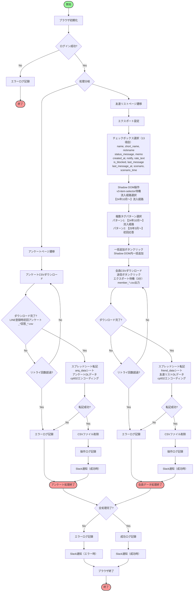

```mermaid
flowchart TD
    Start([開始]) --> Init[ブラウザ初期化]
    Init --> Login{ログイン成功?}
    
    Login -->|No| ErrorLog1[エラーログ記録]
    ErrorLog1 --> End1([終了])
    
    Login -->|Yes| ParallelPath{処理分岐}
    
    %% アンケートデータ処理フロー
    ParallelPath --> Questionnaire[アンケートページ遷移]
    Questionnaire --> QDownload[アンケートCSVダウンロード]
    QDownload --> QWait{ダウンロード完了?\nLINE登録時初回アンケート\n_*回答_*.csv}
    
    QWait -->|No| QRetry{リトライ回数超過?}
    QRetry -->|No| QDownload
    QRetry -->|Yes| QError[エラーログ記録]
    
    QWait -->|Yes| QSpreadsheet[スプレッドシート転記\nanq_dataシート\nアンケートDLデータ\ncp932エンコーディング]
    QSpreadsheet --> QResult{転記成功?}
    
    QResult -->|No| QError
    QError --> QEnd([アンケート処理終了])
    
    QResult -->|Yes| QDelete[CSVファイル削除]
    QDelete --> QLog[操作ログ記録]
    QLog --> QSlack[Slack通知（成功時）]
    QSlack --> QEnd
    
    %% 会員データ処理フロー
    ParallelPath --> Friend[友達リストページ遷移]
    Friend --> FConfig[エクスポート設定]
    FConfig --> FCheckbox[チェックボックス選択（13項目）\nname, short_name, nickname\nstatus_message, memo\ncreated_at, notify, rate_text\nis_blocked, last_message\nlast_message_at, scenario, scenario_time]
    FCheckbox --> FShadow[Shadow DOM操作\nv3-item-selector待機\n流入経路選択\n【24年10月～】流入経路]
    FShadow --> FTag[複数タグパターン選択\nパターン1: 【24年10月～】流入経路\nパターン2: 【25年3月～】初回応答]
    FTag --> FAdd[一括追加ボタンクリック\nShadow DOM内一括追加]
    FAdd --> FDownload[会員CSVダウンロード\n送信ボタンクリック\nエクスポート待機（3分）\nmember_*.csv出力]
    FDownload --> FWait{ダウンロード完了?}
    
    FWait -->|No| FRetry{リトライ回数超過?}
    FRetry -->|No| FDownload
    FRetry -->|Yes| FError[エラーログ記録]
    
    FWait -->|Yes| FSpreadsheet[スプレッドシート転記\nfriend_dataシート\n友達リストDLデータ\ncp932エンコーディング]
    FSpreadsheet --> FResult{転記成功?}
    
    FResult -->|No| FError
    FError --> FEnd([会員データ処理終了])
    
    FResult -->|Yes| FDelete[CSVファイル削除]
    FDelete --> FLog[操作ログ記録]
    FLog --> FSlack[Slack通知（成功時）]
    FSlack --> FEnd
    
    %% 終了処理
    QEnd & FEnd --> AllComplete{全処理完了?}
    AllComplete -->|No| ErrorLog2[エラーログ記録]
    ErrorLog2 --> SlackError[Slack通知（エラー時）]
    SlackError --> Cleanup[ブラウザ終了]
    
    AllComplete -->|Yes| SuccessLog[成功ログ記録]
    SuccessLog --> SlackSuccess[Slack通知（成功時）]
    SlackSuccess --> Cleanup
    
    Cleanup --> End2([終了])

    %% スタイル定義
    style Start fill:#9f9,stroke:#333,stroke-width:2px
    style End1 fill:#f99,stroke:#333,stroke-width:2px
    style End2 fill:#f99,stroke:#333,stroke-width:2px
    style QEnd fill:#f99,stroke:#333,stroke-width:2px
    style FEnd fill:#f99,stroke:#333,stroke-width:2px
``` 