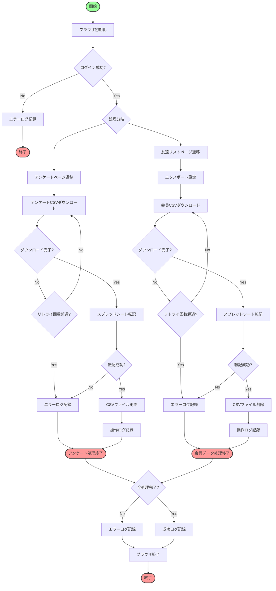

```mermaid
flowchart TD
    Start([開始]) --> Init[ブラウザ初期化]
    Init --> Login{ログイン成功?}
    
    Login -->|No| ErrorLog1[エラーログ記録]
    ErrorLog1 --> End1([終了])
    
    Login -->|Yes| ParallelPath{処理分岐}
    
    %% アンケートデータ処理フロー
    ParallelPath --> Questionnaire[アンケートページ遷移]
    Questionnaire --> QDownload[アンケートCSVダウンロード]
    QDownload --> QWait{ダウンロード完了?}
    
    QWait -->|No| QRetry{リトライ回数超過?}
    QRetry -->|No| QDownload
    QRetry -->|Yes| QError[エラーログ記録]
    
    QWait -->|Yes| QSpreadsheet[スプレッドシート転記]
    QSpreadsheet --> QResult{転記成功?}
    
    QResult -->|No| QError
    QError --> QEnd([アンケート処理終了])
    
    QResult -->|Yes| QDelete[CSVファイル削除]
    QDelete --> QLog[操作ログ記録]
    QLog --> QEnd
    
    %% 会員データ処理フロー
    ParallelPath --> Friend[友達リストページ遷移]
    Friend --> FConfig[エクスポート設定]
    FConfig --> FDownload[会員CSVダウンロード]
    FDownload --> FWait{ダウンロード完了?}
    
    FWait -->|No| FRetry{リトライ回数超過?}
    FRetry -->|No| FDownload
    FRetry -->|Yes| FError[エラーログ記録]
    
    FWait -->|Yes| FSpreadsheet[スプレッドシート転記]
    FSpreadsheet --> FResult{転記成功?}
    
    FResult -->|No| FError
    FError --> FEnd([会員データ処理終了])
    
    FResult -->|Yes| FDelete[CSVファイル削除]
    FDelete --> FLog[操作ログ記録]
    FLog --> FEnd
    
    %% 終了処理
    QEnd & FEnd --> AllComplete{全処理完了?}
    AllComplete -->|No| ErrorLog2[エラーログ記録]
    ErrorLog2 --> Cleanup[ブラウザ終了]
    
    AllComplete -->|Yes| SuccessLog[成功ログ記録]
    SuccessLog --> Cleanup
    
    Cleanup --> End2([終了])

    %% スタイル定義
    style Start fill:#9f9,stroke:#333,stroke-width:2px
    style End1 fill:#f99,stroke:#333,stroke-width:2px
    style End2 fill:#f99,stroke:#333,stroke-width:2px
    style QEnd fill:#f99,stroke:#333,stroke-width:2px
    style FEnd fill:#f99,stroke:#333,stroke-width:2px
``` 