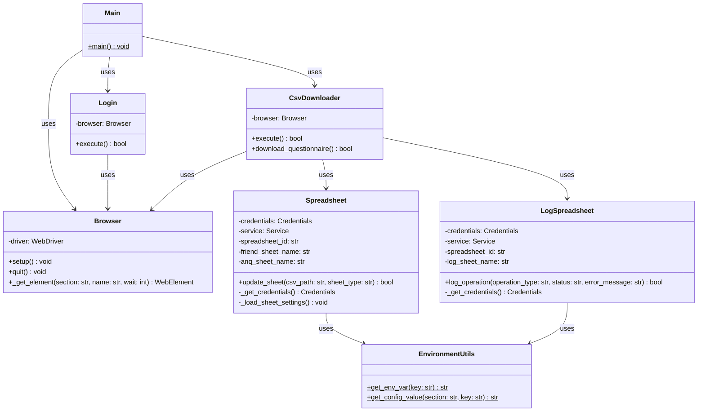

```mermaid
classDiagram
    class Browser {
        -driver: WebDriver
        +setup() void
        +quit() void
        +_get_element(section: str, name: str, wait: int) WebElement
    }

    class Login {
        -browser: Browser
        +execute() bool
    }

    class CsvDownloader {
        -browser: Browser
        +execute() bool
        +download_questionnaire() bool
    }

    class Spreadsheet {
        -credentials: Credentials
        -service: Service
        -spreadsheet_id: str
        -friend_sheet_name: str
        -anq_sheet_name: str
        +update_sheet(csv_path: str, sheet_type: str) bool
        -_get_credentials() Credentials
        -_load_sheet_settings() void
    }

    class LogSpreadsheet {
        -credentials: Credentials
        -service: Service
        -spreadsheet_id: str
        -log_sheet_name: str
        +log_operation(operation_type: str, status: str, error_message: str) bool
        -_get_credentials() Credentials
    }

    class EnvironmentUtils {
        +get_env_var(key: str)$ str
        +get_config_value(section: str, key: str)$ str
    }

    class Main {
        +main()$ void
    }

    Main --> Browser : uses
    Main --> Login : uses
    Main --> CsvDownloader : uses
    Login --> Browser : uses
    CsvDownloader --> Browser : uses
    CsvDownloader --> Spreadsheet : uses
    CsvDownloader --> LogSpreadsheet : uses
    Spreadsheet --> EnvironmentUtils : uses
    LogSpreadsheet --> EnvironmentUtils : uses 
```
