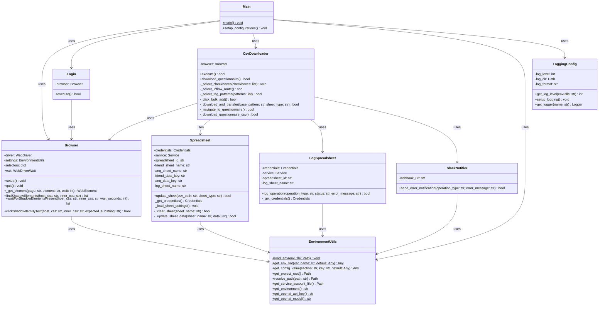

```mermaid
classDiagram
    class Browser {
        -driver: WebDriver
        -settings: EnvironmentUtils
        -selectors: dict
        -wait: WebDriverWait
        +setup() void
        +quit() void
        +_get_element(page: str, element: str, wait: int) WebElement
        +findShadowElements(host_css: str, inner_css: str) list
        +waitForShadowElementsPresent(host_css: str, inner_css: str, wait_seconds: int) list
        +clickShadowItemByText(host_css: str, inner_css: str, expected_substring: str) bool
    }

    class Login {
        -browser: Browser
        +execute() bool
    }

    class CsvDownloader {
        -browser: Browser
        +execute() bool
        +download_questionnaire() bool
        
        %% 友達リストデータ処理
        -_select_checkboxes(checkboxes: list) void
        -_select_inflow_route() bool
        -_select_tag_patterns(patterns: list) bool
        -_click_bulk_add() bool
        -_download_and_transfer(base_pattern: str, sheet_type: str) bool
        
        %% アンケートデータ処理
        -_navigate_to_questionnaire() bool
        -_download_questionnaire_csv() bool
    }

    class Spreadsheet {
        -credentials: Credentials
        -service: Service
        -spreadsheet_id: str
        -friend_sheet_name: str
        -anq_sheet_name: str
        +update_sheet(csv_path: str, sheet_type: str) bool
        -_get_credentials() Credentials
        -_load_sheet_settings() void
        
        %% シート名管理
        -friend_data_key: str
        -anq_data_key: str
        -log_sheet_name: str
        
        %% データ転記処理
        -_clear_sheet(sheet_name: str) bool
        -_update_sheet_data(sheet_name: str, data: list) bool
    }

    class LogSpreadsheet {
        -credentials: Credentials
        -service: Service
        -spreadsheet_id: str
        -log_sheet_name: str
        +log_operation(operation_type: str, status: str, error_message: str) bool
        -_get_credentials() Credentials
    }

    class EnvironmentUtils {
        +load_env(env_file: Path)$ void
        +get_env_var(var_name: str, default: Any)$ Any
        +get_config_value(section: str, key: str, default: Any)$ Any
        +get_project_root()$ Path
        +resolve_path(path: str)$ Path
        +get_service_account_file()$ Path
        +get_environment()$ str
        +get_openai_api_key()$ str
        +get_openai_model()$ str
    }

    class Main {
        +main()$ void
        +setup_configurations() void
    }

    class SlackNotifier {
        -webhook_url: str
        +send_error_notification(operation_type: str, error_message: str) bool
    }

    class LoggingConfig {
        -log_level: int
        -log_dir: Path
        -log_format: str
        +get_log_level(envutils: str) int
        +setup_logging() void
        +get_logger(name: str) Logger
    }

    Main --> Browser : uses
    Main --> Login : uses
    Main --> CsvDownloader : uses
    Main --> EnvironmentUtils : uses
    Main --> LoggingConfig : uses
    Login --> Browser : uses
    CsvDownloader --> Browser : uses
    CsvDownloader --> Spreadsheet : uses
    CsvDownloader --> LogSpreadsheet : uses
    CsvDownloader --> SlackNotifier : uses
    Spreadsheet --> EnvironmentUtils : uses
    LogSpreadsheet --> EnvironmentUtils : uses
    SlackNotifier --> EnvironmentUtils : uses
    Browser --> EnvironmentUtils : uses 
```
