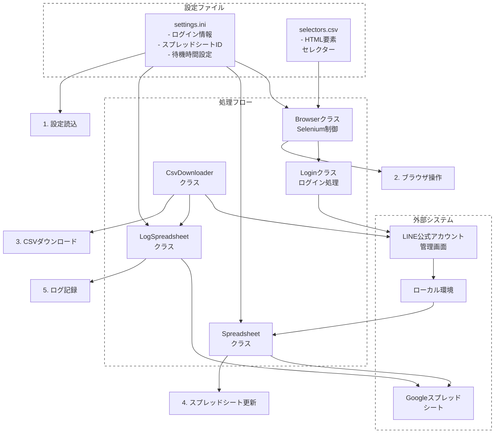

```mermaid
flowchart TD
    subgraph External["外部システム"]
        LINE["LINE公式アカウント\n管理画面"]
        GSheet["Googleスプレッド\nシート"]
        Local["ローカル環境"]
    end

    subgraph Config["設定ファイル"]
        Settings["settings.ini\n- ログイン情報\n- スプレッドシートID\n- 待機時間設定"]
        Selectors["selectors.csv\n- HTML要素\nセレクター"]
    end

    subgraph Process["処理フロー"]
        Browser["Browserクラス\nSelenium制御"]
        Login["Loginクラス\nログイン処理"]
        CSV["CsvDownloader\nクラス"]
        Sheet["Spreadsheet\nクラス"]
        Log["LogSpreadsheet\nクラス"]
    end

    %% 設定ファイルの流れ
    Settings --> Browser
    Settings --> Sheet
    Settings --> Log
    Selectors --> Browser

    %% ログイン処理
    Browser --> Login
    Login --> LINE

    %% CSVダウンロード処理
    CSV --> LINE
    LINE --> Local
    Local --> Sheet
    Sheet --> GSheet

    %% ログ記録
    CSV --> Log
    Log --> GSheet

    %% データの流れを示す注釈
    classDef note fill:#fff,stroke:#333,stroke-dasharray: 5 5
    class External,Config,Process note

    %% フローの説明
    note1["1. 設定読込"]
    note2["2. ブラウザ操作"]
    note3["3. CSVダウンロード"]
    note4["4. スプレッドシート更新"]
    note5["5. ログ記録"]

    Settings --> note1
    Browser --> note2
    CSV --> note3
    Sheet --> note4
    Log --> note5
``` 