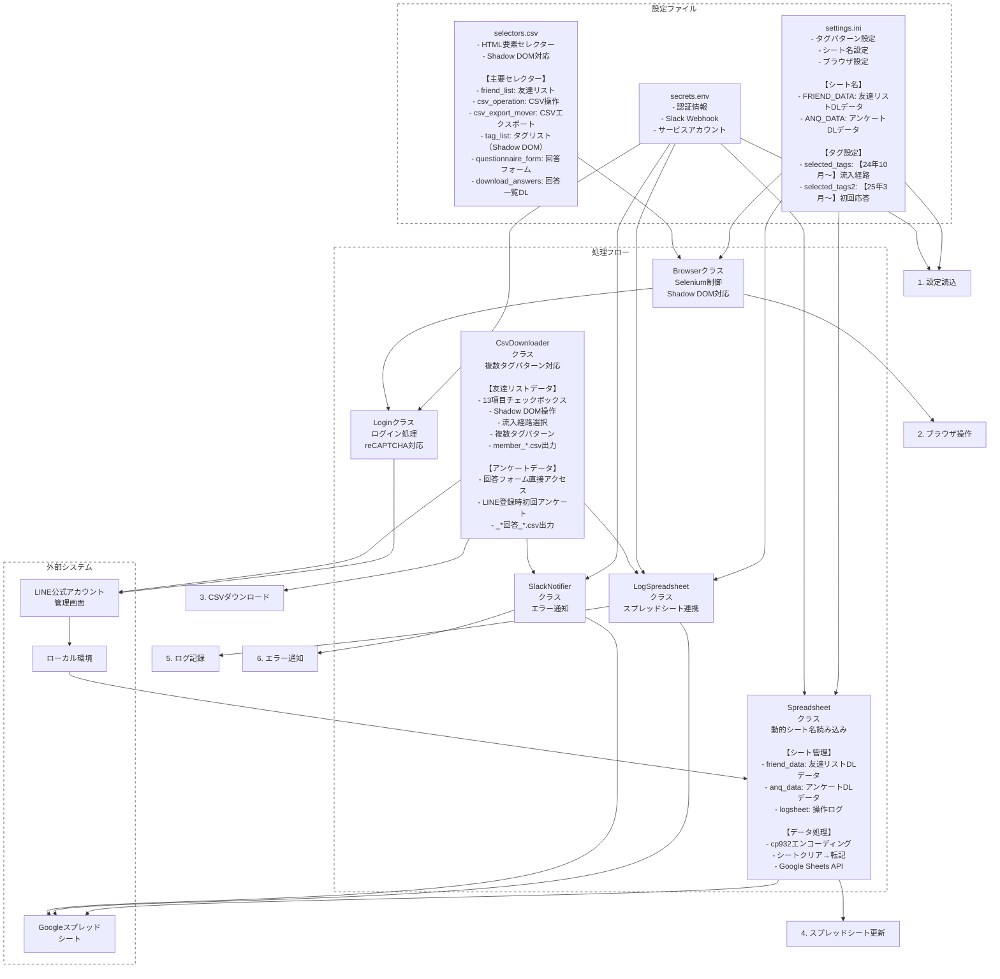

```mermaid
flowchart TD
    subgraph External["外部システム"]
        LINE["LINE公式アカウント\n管理画面"]
        GSheet["Googleスプレッド\nシート"]
        Local["ローカル環境"]
    end

    subgraph Config["設定ファイル"]
        Settings["settings.ini\n- タグパターン設定\n- シート名設定\n- ブラウザ設定\n\n【シート名】\n- FRIEND_DATA: 友達リストDLデータ\n- ANQ_DATA: アンケートDLデータ\n\n【タグ設定】\n- selected_tags: 【24年10月～】流入経路\n- selected_tags2: 【25年3月～】初回応答"]
        Selectors["selectors.csv\n- HTML要素セレクター\n- Shadow DOM対応\n\n【主要セレクター】\n- friend_list: 友達リスト\n- csv_operation: CSV操作\n- csv_export_mover: CSVエクスポート\n- tag_list: タグリスト（Shadow DOM）\n- questionnaire_form: 回答フォーム\n- download_answers: 回答一覧DL"]
        Secrets["secrets.env\n- 認証情報\n- Slack Webhook\n- サービスアカウント"]
    end

    subgraph Process["処理フロー"]
        Browser["Browserクラス\nSelenium制御\nShadow DOM対応"]
        Login["Loginクラス\nログイン処理\nreCAPTCHA対応"]
        CSV["CsvDownloader\nクラス\n複数タグパターン対応\n\n【友達リストデータ】\n- 13項目チェックボックス\n- Shadow DOM操作\n- 流入経路選択\n- 複数タグパターン\n- member_*.csv出力\n\n【アンケートデータ】\n- 回答フォーム直接アクセス\n- LINE登録時初回アンケート\n- _*回答_*.csv出力"]
        Sheet["Spreadsheet\nクラス\n動的シート名読み込み\n\n【シート管理】\n- friend_data: 友達リストDLデータ\n- anq_data: アンケートDLデータ\n- logsheet: 操作ログ\n\n【データ処理】\n- cp932エンコーディング\n- シートクリア→転記\n- Google Sheets API"]
        Log["LogSpreadsheet\nクラス\nスプレッドシート連携"]
        Slack["SlackNotifier\nクラス\nエラー通知"]
    end

    %% 設定ファイルの流れ
    Settings --> Browser
    Settings --> Sheet
    Settings --> Log
    Selectors --> Browser
    Secrets --> Login
    Secrets --> Sheet
    Secrets --> Log
    Secrets --> Slack

    %% ログイン処理
    Browser --> Login
    Login --> LINE

    %% CSVダウンロード処理
    CSV --> LINE
    LINE --> Local
    Local --> Sheet
    Sheet --> GSheet

    %% ログ記録
    CSV --> Log
    Log --> GSheet

    %% Slack通知
    CSV --> Slack
    Slack --> GSheet

    %% データの流れを示す注釈
    classDef note fill:#fff,stroke:#333,stroke-dasharray: 5 5
    class External,Config,Process note

    %% フローの説明
    note1["1. 設定読込"]
    note2["2. ブラウザ操作"]
    note3["3. CSVダウンロード"]
    note4["4. スプレッドシート更新"]
    note5["5. ログ記録"]
    note6["6. エラー通知"]

    Settings --> note1
    Secrets --> note1
    Browser --> note2
    CSV --> note3
    Sheet --> note4
    Log --> note5
    Slack --> note6
``` 