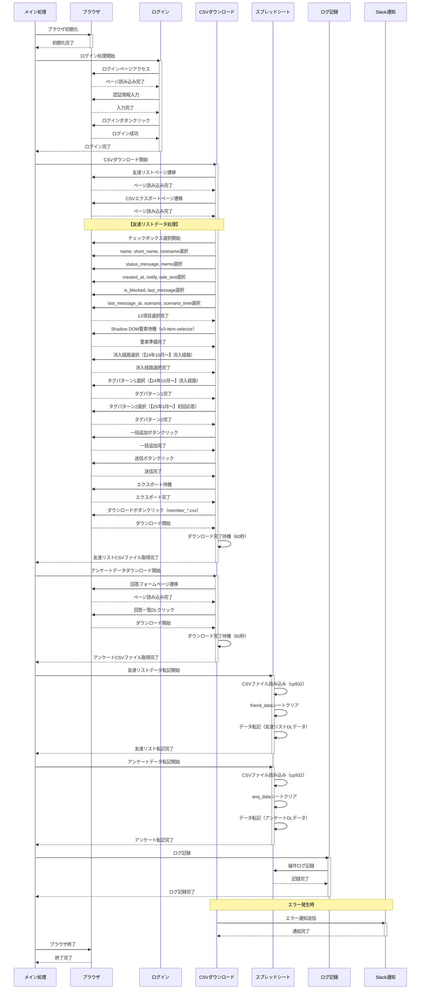

# シーケンス図

```mermaid
sequenceDiagram
    participant Main as メイン処理
    participant Browser as ブラウザ
    participant Login as ログイン
    participant CSV as CSVダウンロード
    participant Sheet as スプレッドシート
    participant Log as ログ記録
    participant Slack as Slack通知

    Main->>Browser: ブラウザ初期化
    activate Browser
    Browser-->>Main: 初期化完了
    deactivate Browser

    Main->>Login: ログイン処理開始
    activate Login
    Login->>Browser: ログインページアクセス
    Browser-->>Login: ページ読み込み完了
    Login->>Browser: 認証情報入力
    Browser-->>Login: 入力完了
    Login->>Browser: ログインボタンクリック
    Browser-->>Login: ログイン成功
    Login-->>Main: ログイン完了
    deactivate Login

    Main->>CSV: CSVダウンロード開始
    activate CSV
    CSV->>Browser: 友達リストページ遷移
    Browser-->>CSV: ページ読み込み完了
    CSV->>Browser: CSVエクスポートページ遷移
    Browser-->>CSV: ページ読み込み完了
    
    %% 友達リストデータ処理詳細
    Note over CSV, Browser: 【友達リストデータ処理】
    CSV->>Browser: チェックボックス選択開始
    CSV->>Browser: name, short_name, nickname選択
    CSV->>Browser: status_message, memo選択
    CSV->>Browser: created_at, notify, rate_text選択
    CSV->>Browser: is_blocked, last_message選択
    CSV->>Browser: last_message_at, scenario, scenario_time選択
    Browser-->>CSV: 13項目選択完了
    
    CSV->>Browser: Shadow DOM要素待機（v3-item-selector）
    Browser-->>CSV: 要素準備完了
    CSV->>Browser: 流入経路選択（【24年10月～】流入経路）
    Browser-->>CSV: 流入経路選択完了
    
    CSV->>Browser: タグパターン1選択（【24年10月～】流入経路）
    Browser-->>CSV: タグパターン1完了
    CSV->>Browser: タグパターン2選択（【25年3月～】初回応答）
    Browser-->>CSV: タグパターン2完了
    CSV->>Browser: 一括追加ボタンクリック
    Browser-->>CSV: 一括追加完了
    
    CSV->>Browser: 送信ボタンクリック
    Browser-->>CSV: 送信完了
    CSV->>Browser: エクスポート待機
    Browser-->>CSV: エクスポート完了
    
    CSV->>Browser: ダウンロードボタンクリック（member_*.csv）
    Browser-->>CSV: ダウンロード開始
    CSV->>CSV: ダウンロード完了待機（60秒）
    CSV-->>Main: 友達リストCSVファイル取得完了
    deactivate CSV

    %% アンケートデータ処理
    Main->>CSV: アンケートデータダウンロード開始
    activate CSV
    CSV->>Browser: 回答フォームページ遷移
    Browser-->>CSV: ページ読み込み完了
    CSV->>Browser: 回答一覧DLクリック
    Browser-->>CSV: ダウンロード開始
    CSV->>CSV: ダウンロード完了待機（60秒）
    CSV-->>Main: アンケートCSVファイル取得完了
    deactivate CSV

    %% スプレッドシート転記処理
    Main->>Sheet: 友達リストデータ転記開始
    activate Sheet
    Sheet->>Sheet: CSVファイル読み込み（cp932）
    Sheet->>Sheet: friend_dataシートクリア
    Sheet->>Sheet: データ転記（友達リストDLデータ）
    Sheet-->>Main: 友達リスト転記完了
    deactivate Sheet

    Main->>Sheet: アンケートデータ転記開始
    activate Sheet
    Sheet->>Sheet: CSVファイル読み込み（cp932）
    Sheet->>Sheet: anq_dataシートクリア
    Sheet->>Sheet: データ転記（アンケートDLデータ）
    Sheet-->>Main: アンケート転記完了
    deactivate Sheet

    Main->>Log: ログ記録
    activate Log
    Log->>Sheet: 操作ログ記録
    Sheet-->>Log: 記録完了
    Log-->>Main: ログ記録完了
    deactivate Log

    Note over CSV,Slack: エラー発生時
    CSV->>Slack: エラー通知送信
    activate Slack
    Slack-->>CSV: 通知完了
    deactivate Slack

    Main->>Browser: ブラウザ終了
    Browser-->>Main: 終了完了
```