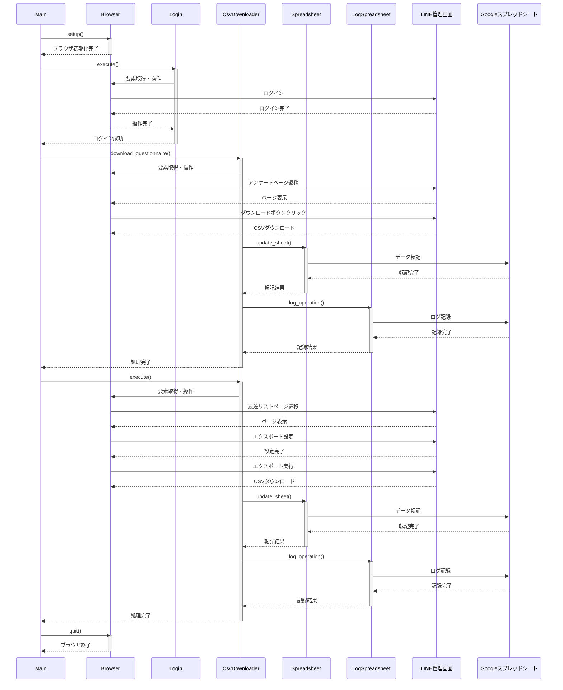

```mermaid
sequenceDiagram
    participant Main
    participant Browser
    participant Login
    participant CSV as CsvDownloader
    participant Sheet as Spreadsheet
    participant Log as LogSpreadsheet
    participant LINE as LINE管理画面
    participant GSheet as Googleスプレッドシート

    Main->>Browser: setup()
    activate Browser
    Browser-->>Main: ブラウザ初期化完了
    deactivate Browser

    Main->>Login: execute()
    activate Login
    Login->>Browser: 要素取得・操作
    Browser->>LINE: ログイン
    LINE-->>Browser: ログイン完了
    Browser-->>Login: 操作完了
    Login-->>Main: ログイン成功
    deactivate Login

    %% アンケートデータ処理
    Main->>CSV: download_questionnaire()
    activate CSV
    CSV->>Browser: 要素取得・操作
    Browser->>LINE: アンケートページ遷移
    LINE-->>Browser: ページ表示
    Browser->>LINE: ダウンロードボタンクリック
    LINE-->>Browser: CSVダウンロード
    
    CSV->>Sheet: update_sheet()
    activate Sheet
    Sheet->>GSheet: データ転記
    GSheet-->>Sheet: 転記完了
    Sheet-->>CSV: 転記結果
    deactivate Sheet
    
    CSV->>Log: log_operation()
    activate Log
    Log->>GSheet: ログ記録
    GSheet-->>Log: 記録完了
    Log-->>CSV: 記録結果
    deactivate Log
    
    CSV-->>Main: 処理完了
    deactivate CSV

    %% 会員データ処理
    Main->>CSV: execute()
    activate CSV
    CSV->>Browser: 要素取得・操作
    Browser->>LINE: 友達リストページ遷移
    LINE-->>Browser: ページ表示
    Browser->>LINE: エクスポート設定
    LINE-->>Browser: 設定完了
    Browser->>LINE: エクスポート実行
    LINE-->>Browser: CSVダウンロード
    
    CSV->>Sheet: update_sheet()
    activate Sheet
    Sheet->>GSheet: データ転記
    GSheet-->>Sheet: 転記完了
    Sheet-->>CSV: 転記結果
    deactivate Sheet
    
    CSV->>Log: log_operation()
    activate Log
    Log->>GSheet: ログ記録
    GSheet-->>Log: 記録完了
    Log-->>CSV: 記録結果
    deactivate Log
    
    CSV-->>Main: 処理完了
    deactivate CSV

    Main->>Browser: quit()
    activate Browser
    Browser-->>Main: ブラウザ終了
    deactivate Browser
``` 