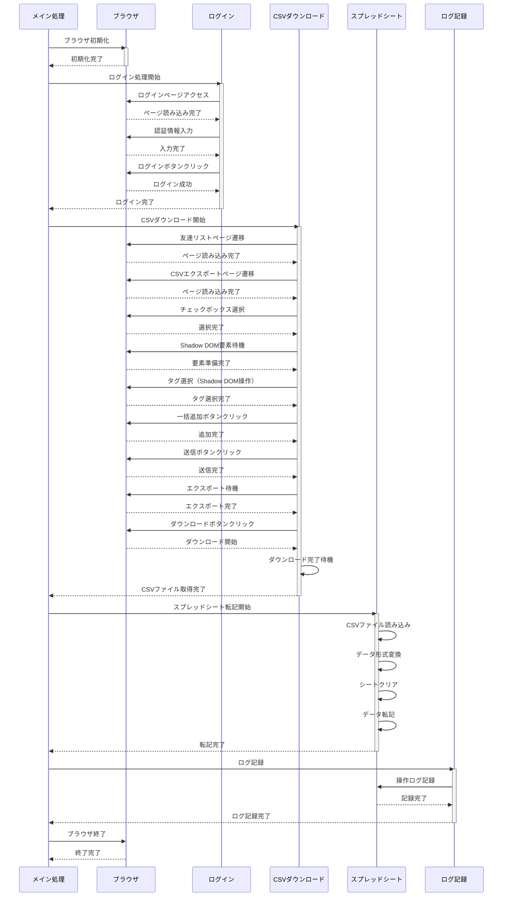

# シーケンス図

```mermaid
sequenceDiagram
    participant Main as メイン処理
    participant Browser as ブラウザ
    participant Login as ログイン
    participant CSV as CSVダウンロード
    participant Sheet as スプレッドシート
    participant Log as ログ記録

    Main->>Browser: ブラウザ初期化
    activate Browser
    Browser-->>Main: 初期化完了
    deactivate Browser

    Main->>Login: ログイン処理開始
    activate Login
    Login->>Browser: ログインページアクセス
    Browser-->>Login: ページ読み込み完了
    Login->>Browser: 認証情報入力
    Browser-->>Login: 入力完了
    Login->>Browser: ログインボタンクリック
    Browser-->>Login: ログイン成功
    Login-->>Main: ログイン完了
    deactivate Login

    Main->>CSV: CSVダウンロード開始
    activate CSV
    CSV->>Browser: 友達リストページ遷移
    Browser-->>CSV: ページ読み込み完了
    CSV->>Browser: CSVエクスポートページ遷移
    Browser-->>CSV: ページ読み込み完了
    
    CSV->>Browser: チェックボックス選択
    Browser-->>CSV: 選択完了
    
    CSV->>Browser: Shadow DOM要素待機
    Browser-->>CSV: 要素準備完了
    CSV->>Browser: タグ選択（Shadow DOM操作）
    Browser-->>CSV: タグ選択完了
    CSV->>Browser: 一括追加ボタンクリック
    Browser-->>CSV: 追加完了
    
    CSV->>Browser: 送信ボタンクリック
    Browser-->>CSV: 送信完了
    CSV->>Browser: エクスポート待機
    Browser-->>CSV: エクスポート完了
    
    CSV->>Browser: ダウンロードボタンクリック
    Browser-->>CSV: ダウンロード開始
    CSV->>CSV: ダウンロード完了待機
    CSV-->>Main: CSVファイル取得完了
    deactivate CSV

    Main->>Sheet: スプレッドシート転記開始
    activate Sheet
    Sheet->>Sheet: CSVファイル読み込み
    Sheet->>Sheet: データ形式変換
    Sheet->>Sheet: シートクリア
    Sheet->>Sheet: データ転記
    Sheet-->>Main: 転記完了
    deactivate Sheet

    Main->>Log: ログ記録
    activate Log
    Log->>Sheet: 操作ログ記録
    Sheet-->>Log: 記録完了
    Log-->>Main: ログ記録完了
    deactivate Log

    Main->>Browser: ブラウザ終了
    Browser-->>Main: 終了完了
```